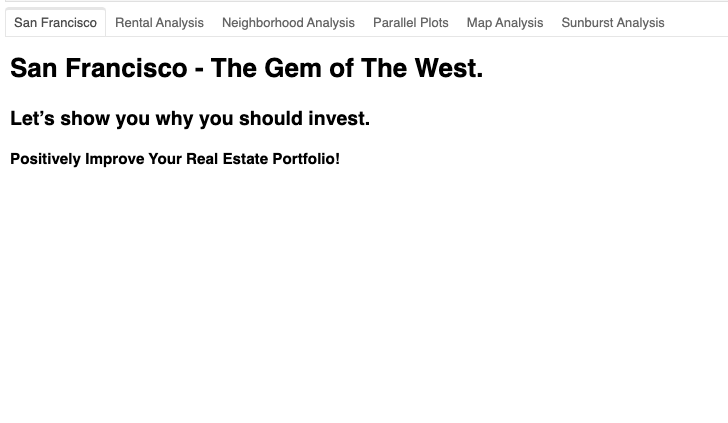
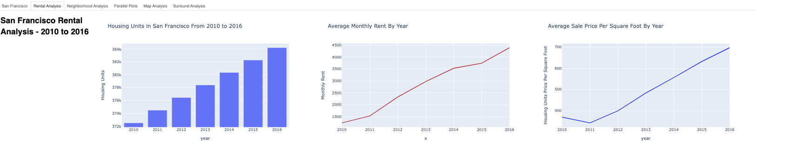
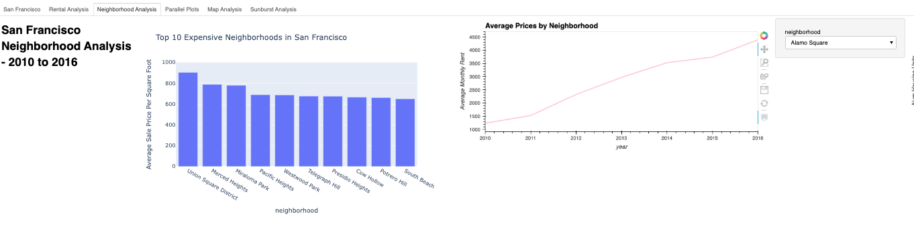
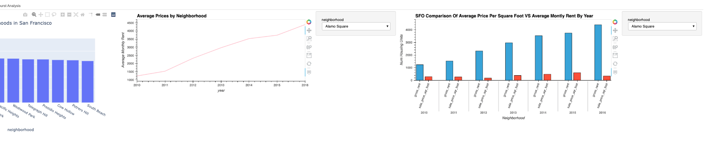
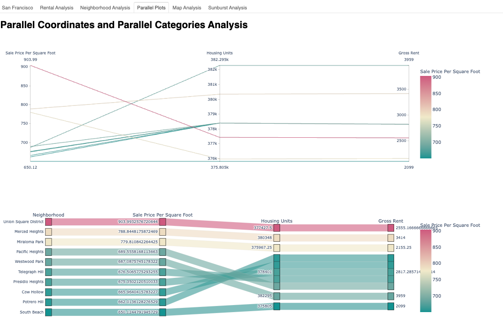
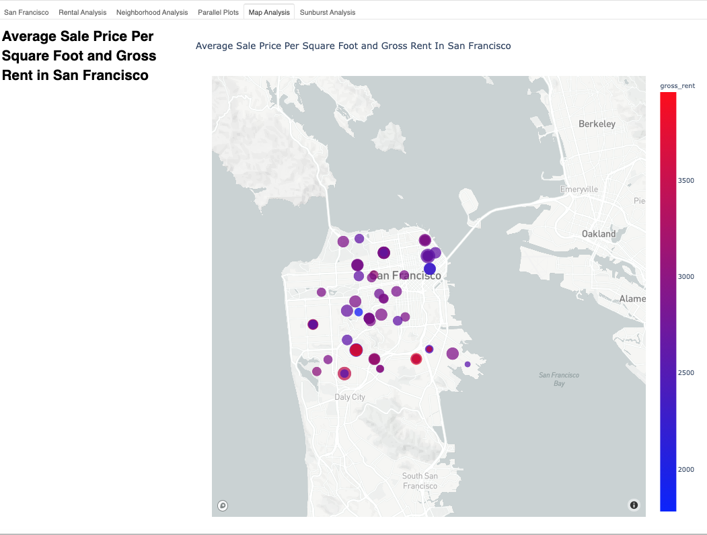
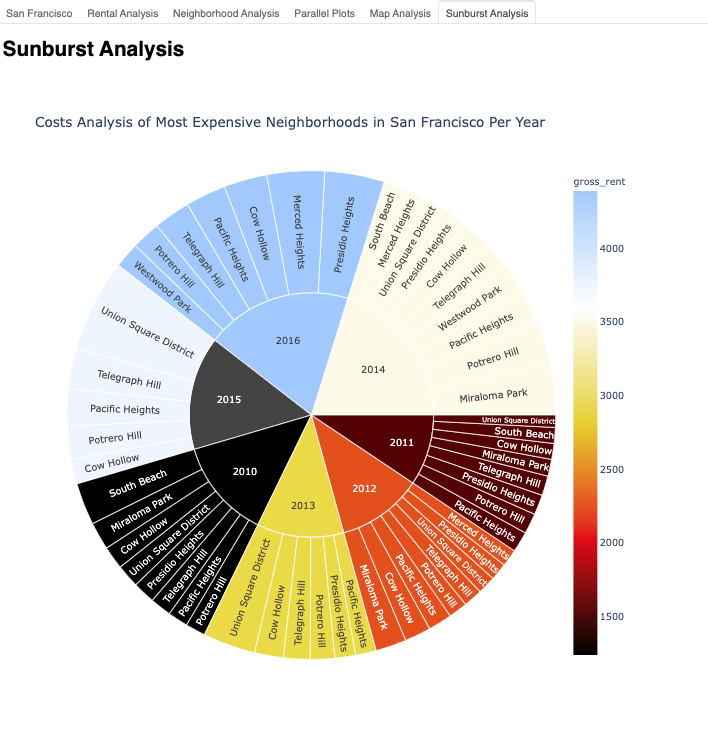

# Unit 6 - Pythonic Monopoly

*[San Francisco Park Reading by Juan Salamanca](https://www.pexels.com/photo/park-san-francisco-reading-61109/) | [Free License](https://www.pexels.com/photo-license/)*

## Background

Harold's company has just started a new Real Estate Investment division to provide customers with a broader range of portfolio options. Harold was tasked with building a prototype dashboard and he needs your help. The real estate team wants to trial this initial offering with investment opportunities for the San Francisco market. If the new service is popular, then they can start to expand to other markets.

The goal of this dashboard is to provide charts, maps, and interactive visualizations that help customers explore the data and determine if they want to invest in rental properties in San Francisco.

In this homework assignment, you will help Harold accomplish the following tasks:

1. [Complete a notebook of rental analysis](#Rental-Analysis).

2. [Create a dashboard of interactive visualizations to explore the market data](#Dashboard).

----
## Dashboard Panel

### Intro to Dashboard

### Rental Analysis

### Neighborhood Analysis

### Parallel Plots

### Map Analysis

### Sunburst Analysis

